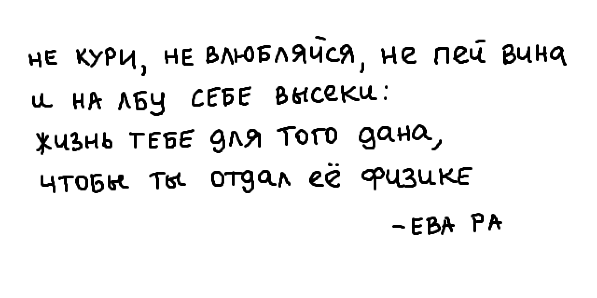

  

---

| SEM | COURSE | LAB | LINKS |
|:---:|:------:|:---:|:-----:|
|***4***|Quantum Mechanics, Optics|[lab_5.04](https://github.com/Lopa10ko/ITMO-physics-math-2022-2023/blob/main/physics/4sem/labs/Lab_5.04.pdf)| [report](https://github.com/Lopa10ko/ITMO-physics-math-2022-2023/blob/main/physics/4sem/labs/M32021_Жуйков_Лопатенко_5.04.pdf)|
|***4***|Quantum Mechanics, Optics|[lab_5.10](https://github.com/Lopa10ko/ITMO-physics-math-2022-2023/blob/main/physics/4sem/labs/Lab_5.10%20v.2.pdf)|[report](https://github.com/Lopa10ko/ITMO-physics-math-2022-2023/blob/main/physics/4sem/labs/M32021_Жуйков_Лопатенко_5.10.pdf)|
|***4***|Quantum Mechanics, Optics|[lab_5.09](https://github.com/Lopa10ko/ITMO-physics-math-2022-2023/blob/main/physics/4sem/labs/Lab_5.09.pdf)|[report](https://github.com/Lopa10ko/ITMO-physics-math-2022-2023/blob/main/physics/4sem/labs/M32021_Жуйков_Лопатенко_5.09.pdf)|
|***4***|Quantum Mechanics, Optics|[lab_IBM.1](https://github.com/Lopa10ko/ITMO-physics-math-2022-2023/blob/main/physics/4sem/labs/IBM.pdf)|[report](https://github.com/Lopa10ko/ITMO-physics-math-2022-2023/blob/main/physics/4sem/labs/M32021_Лопатенко_IBM1.pdf)|
|***4***|Quantum Mechanics, Optics|[lab_IBM.2](https://github.com/Lopa10ko/ITMO-physics-math-2022-2023/blob/main/physics/4sem/labs/IBM.pdf)|[report](https://github.com/Lopa10ko/ITMO-physics-math-2022-2023/blob/main/physics/4sem/labs/M32021_Лопатенко_IBM2.pdf)|
|***3***|Electromagnetism, Optics|[lab_3.00](https://github.com/Lopa10ko/ITMO-physics-math-2022-2023/blob/main/physics/3sem/labs/Lab_3_00_GDS.pdf)| [report](https://github.com/Lopa10ko/ITMO-physics-math-2022-2023/blob/main/physics/3sem/labs/M32021_Лопатенко%20Г.В._3.00.pdf) and [data](https://github.com/Lopa10ko/ITMO-physics-math-2022-2023/tree/main/physics/3sem/labs_data/data_lab3_00)|
|***3***|Electromagnetism, Optics|[lab_3.13](https://github.com/Lopa10ko/ITMO-physics-math-2022-2023/blob/main/physics/3sem/labs/Lab_3_13.pdf)|[report](https://github.com/Lopa10ko/ITMO-physics-math-2022-2023/blob/main/physics/3sem/labs/M32021_Воробьёва%20М.А._Лопатенко%20Г.В._Хасан%20К.А_3.13.pdf) and [data]()|
|***3***|Electromagnetism, Optics|[lab_1.05](https://github.com/Lopa10ko/ITMO-physics-math-2022-2023/blob/main/physics/3sem/labs/Lab_1_05.pdf)|[report](https://github.com/Lopa10ko/ITMO-physics-math-2022-2023/blob/main/physics/3sem/labs/M32021_Лопатенко_Жуйков_1.05.pdf) and [data](https://github.com/Lopa10ko/ITMO-physics-math-2022-2023/blob/main/physics/3sem/labs_data/data_lab1_05.xlsx)|
|***3***|Electromagnetism, Optics|[lab_4.02](https://github.com/Lopa10ko/ITMO-physics-math-2022-2023/blob/main/physics/3sem/labs/Lab_4_02.pdf)|[report](https://github.com/Lopa10ko/ITMO-physics-math-2022-2023/blob/main/physics/3sem/labs/M32021_Жуйков_Лопатенко_Хасан_4.02.pdf) and [data](https://github.com/Lopa10ko/ITMO-physics-math-2022-2023/blob/main/physics/3sem/labs_data/data_lab4_02/data_lab4_02.xlsx)|
|***3***|Electromagnetism, Optics|[lab_4.06](https://github.com/Lopa10ko/ITMO-physics-math-2022-2023/blob/main/physics/3sem/labs/Lab_4_06.pdf)|[report](https://github.com/Lopa10ko/ITMO-physics-math-2022-2023/blob/main/physics/3sem/labs/M32021_Жуйков_Лопатенко_Хасан_4.06.pdf) and [data](https://github.com/Lopa10ko/ITMO-physics-math-2022-2023/blob/main/physics/3sem/labs_data/data_lab4_06/data_lab4_06.xlsx)|
|***3***|Electromagnetism, Optics|[lab_1.14](https://github.com/Lopa10ko/ITMO-physics-math-2022-2023/blob/main/physics/3sem/labs/Lab_1_14.pdf)|[report](https://github.com/Lopa10ko/ITMO-physics-math-2022-2023/blob/main/physics/3sem/labs/M32021_Корнилов_Н.В_1.14.pdf)|
|***3***|Electromagnetism, Optics|[lab_3.08](https://github.com/Lopa10ko/ITMO-physics-math-2022-2023/blob/main/physics/3sem/labs/Lab_3_08.pdf)|[report](https://github.com/Lopa10ko/ITMO-physics-math-2022-2023/blob/main/physics/3sem/labs/M32021_Корнилов_Н.В_3.08.pdf)|
|***3***|Electromagnetism, Optics|[lab_3.11](https://github.com/Lopa10ko/ITMO-physics-math-2022-2023/blob/main/physics/3sem/labs/Lab_3_11.pdf)|[report](https://github.com/Lopa10ko/ITMO-physics-math-2022-2023/blob/main/physics/3sem/labs/M32021_Корнилов_Н.В_3.11.pdf)|
|***3***|Electromagnetism, Optics|[lab_4.07](https://github.com/Lopa10ko/ITMO-physics-math-2022-2023/blob/main/physics/3sem/labs/Lab_4_07.pdf)|[report](https://github.com/Lopa10ko/ITMO-physics-math-2022-2023/blob/main/physics/3sem/labs/M32021_Корнилов_Н.В_4.07.pdf)|
|***3***|Electromagnetism, Optics|[lab_4.10](https://github.com/Lopa10ko/ITMO-physics-math-2022-2023/blob/main/physics/3sem/labs/Lab_4_10.pdf)|[report](https://github.com/Lopa10ko/ITMO-physics-math-2022-2023/blob/main/physics/3sem/labs/M32021_Корнилов_Н.В_4.10.pdf)|
|***2***|Mechanics, Electrostatics|[lab_1.01](https://github.com/Lopa10ko/ITMO-physics-math-2022-2023/blob/main/physics/2sem/labs/Lab_1_01.pdf)|[report](https://github.com/Lopa10ko/ITMO-physics-math-2022-2023/blob/main/physics/2sem/labs/M3102_Лопатенко%20Г.В._1.01.pdf)|
|***2***|Mechanics, Electrostatics|[lab_1.02](https://github.com/Lopa10ko/ITMO-physics-math-2022-2023/blob/main/physics/2sem/labs/Lab_1_02.pdf)|[report](https://github.com/Lopa10ko/ITMO-physics-math-2022-2023/blob/main/physics/2sem/labs/M3102_Лопатенко%20Г.В._1.02.pdf) and [data](https://github.com/Lopa10ko/ITMO-physics-math-2022-2023/blob/main/physics/2sem/labs_data/M3102_Лопатенко_1_02_измерения.pdf)|
|***2***|Mechanics, Electrostatics|[lab_1.04](https://github.com/Lopa10ko/ITMO-physics-math-2022-2023/blob/main/physics/2sem/labs/Lab_1_04.pdf)|[report](https://github.com/Lopa10ko/ITMO-physics-math-2022-2023/blob/main/physics/2sem/labs/M3102_Лопатенко%20Г.В._1.04.pdf) and [data](https://github.com/Lopa10ko/ITMO-physics-math-2022-2023/blob/main/physics/2sem/labs_data/M3102_Лопатенко_1_04_измерения.pdf)|
|***2***|Mechanics, Electrostatics|[lab_3.01](https://github.com/Lopa10ko/ITMO-physics-math-2022-2023/blob/main/physics/2sem/labs/Lab_3_01A.pdf)|[report](https://github.com/Lopa10ko/ITMO-physics-math-2022-2023/blob/main/physics/2sem/labs/M3102_Лопатенко%20Г.В._3.01.pdf) and [data](https://github.com/Lopa10ko/ITMO-physics-math-2022-2023/blob/main/physics/2sem/labs_data/M3102_Лопатенко_3_01_измерения.pdf)|
|***2***|Mechanics, Electrostatics|[lab_3.02](https://github.com/Lopa10ko/ITMO-physics-math-2022-2023/blob/main/physics/2sem/labs/Lab_3_02.pdf)|[report](https://github.com/Lopa10ko/ITMO-physics-math-2022-2023/blob/main/physics/2sem/labs/M3102_Лопатенко%20Г.В._3.02.pdf) and [data](https://github.com/Lopa10ko/ITMO-physics-math-2022-2023/blob/main/physics/2sem/labs_data/M3102_Лопатенко_3_02_измерения.pdf)|
|***2***|Mechanics, Electrostatics|[lab_5.06](https://github.com/Lopa10ko/ITMO-physics-math-2022-2023/blob/main/physics/4sem/labs/Lab_5_06.pdf)|[report](https://github.com/Lopa10ko/ITMO-physics-math-2022-2023/blob/main/physics/4sem/labs/M32021_Корнилов_Н.В_5.06.pdf)|
|***2***|Mechanics, Electrostatics|[lab_5.07](https://github.com/Lopa10ko/ITMO-physics-math-2022-2023/blob/main/physics/4sem/labs/Lab_5_07.pdf)|[report](https://github.com/Lopa10ko/ITMO-physics-math-2022-2023/blob/main/physics/4sem/labs/M32021_Корнилов_Н.В_5.07.pdf)|

